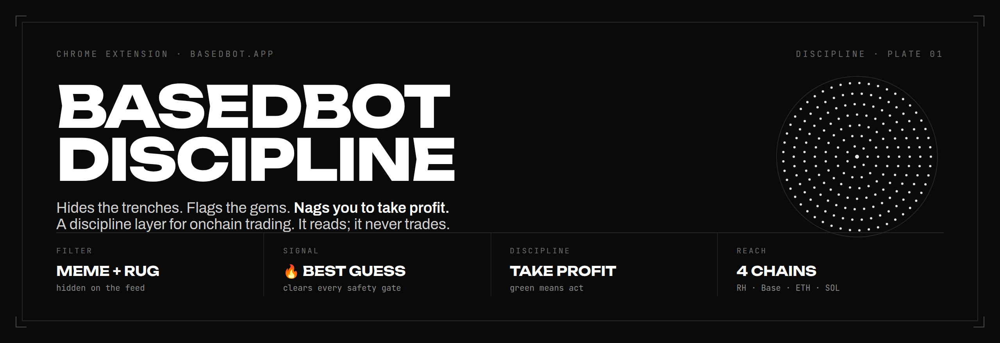
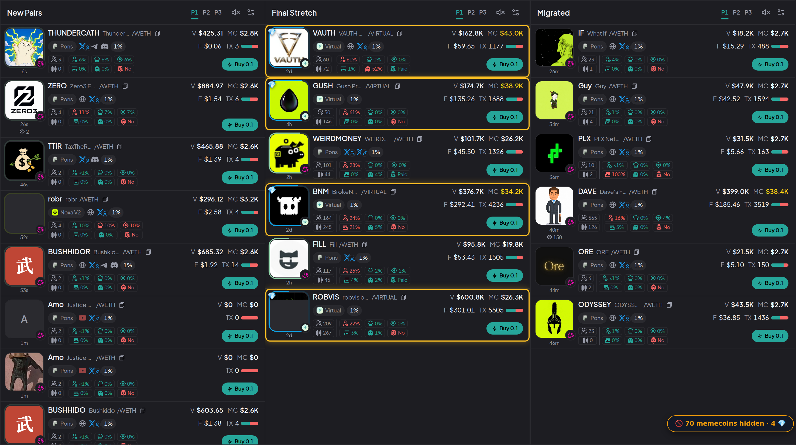
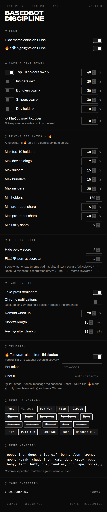

  

# BasedBot Discipline

A Chrome extension for [basedbot.app](https://basedbot.app) that does the two
things most traders wish they did themselves:

1. **Cleans your Pulse feed** — hides meme spam and rug-risk tokens, keeps
   utility projects visible, and flags the rare token that clears every safety
   check.
2. **Nags you to take profit** — when a coin you actually hold goes green past
   your threshold, it puts a banner in your face until you act.

No auto-trading. It never touches the buy or sell button. It reads what's on
the page and tells you what it sees. Nothing leaves your browser except the
Telegram messages you configure yourself.

Works on every chain basedbot's Pulse supports (Robinhood, Base, Ethereum,
Solana, and more).

---

## What it looks like

**The feed, filtered.** 70 meme launches hidden, four 💎 candidates ringed in
gold, the count on the chip. This is a real Pulse feed, classified live:

  

**Every parameter, yours.** The popup exposes the full control surface: hide
rules, 🔥 gates, tax limit, take-profit thresholds, Telegram:

  

---

## Install (2 minutes)

1. Download the latest release, or clone this repo. Unzip somewhere
   **permanent** — Chrome loads the extension from that folder, so don't delete
   it.
2. Open `chrome://extensions`.
3. Turn on **Developer mode** (top right).
4. Click **Load unpacked** and select the folder.
5. Open basedbot.app → Pulse. An orange chip appears bottom-right. Done.

Settings live in the toolbar popup (click the extension icon).

**Updating:** `git pull` (or re-download the release over the same folder),
then `chrome://extensions` → reload → refresh your basedbot tabs. Your settings
survive — they live in `chrome.storage`, not the files.

---

## What it does

### The feed filter (Pulse)

Every card is scored. A token is hidden when its name is a meme
(pepe/inu/bonk…), or it has no web presence and weak on-chain structure.
**Anything with a real website, GitHub, or docs is never auto-hidden** — the
filter kills spam, not your judgment. Card data comes from basedbot's own JSON
API (immune to layout changes), with DOM parsing as a fallback.

- The orange chip shows the hidden count. Click it to peek — hidden cards
  reappear outlined.
- Hover any card for a hide/keep button. Overrides are permanent per token and
  listed in the popup.

### Safety hide rules

Hard rug-risk filters, each with its own toggle and adjustable threshold:

| Rule | Default | On by default |
|---|---|---|
| Top-10 holders own > | 40% | yes |
| Insiders own > | 20% | opt-in |
| Bundlers own > | 30% | opt-in |
| Snipers own > | 30% | opt-in |
| Dev holds > | 10% | opt-in |

Any *enabled* rule that a token exceeds hides it, even if it has a website —
high concentration is a pre-loaded dump. Coins you hold or marked "always show"
are never hidden.

### 🔥 Best guess & 💎 gem highlights

The extension reads each card's safety stats and marks the standouts:

- **🔥 Best guess** — clears every safety gate *and* shows real utility
  evidence (website plus docs/GitHub/agent-platform signals). Meme-named tokens
  can never be 🔥. Rare by design.
- **💎** — strong utility but not the full sweep. Worth a look, not a verdict.

Every gate is editable in the popup (max top-10/dev/snipers/bundlers/insiders,
min holders, min/max pro-trader share, min utility score).

### 🛡 Token-page verdict

Open any token and a chip reads the Token Info panel for you — top-10, dev,
snipers, insiders, bundlers, Dex Paid, LP burned/locked, renounced, and
**buy/sell tax** (the honeypot check; tax only exists on the token page, not the
feed). Green = clean, amber = 1–2 warnings, red = walk away.

### The take-profit banner

On any token page or your Portfolio, the extension reads your position PnL.
Every position over your threshold (default +20%) gets its own row in a
persistent banner — symbol, gain, and a link to its chart, each with its own
snooze and dismiss. Dismissing one doesn't hide the others. A common pattern
from profitable traders: treat it as "sell half", not "sell all".

### Cut losses & protect winners

The banner runs both ways. A **stop-loss** row nags when a position falls past
your limit (default −25%), so losers get cut, not just winners taken. A
**peak-giveback** row warns when an open winner hands back too many points from
its observed peak — a trailing-discipline prompt (it never executes trades).

### Trade journal & behavior mirror

Every position's lifecycle is logged locally as an immutable per-trade record:
entry safety snapshot, peak, and — only when the last PnL sample was fresh — a
realized exit. The popup mirrors your behavior back: win rate, average tracked
exit, and **average profit given back** (the number the take-profit banner
exists to shrink). Export or clear it anytime; nothing leaves your machine.

### Anti-FOMO guards

A daily losing-trade limit shows a "step away" overlay once you've closed too
many losers today. Re-buying a token you recently closed at a loss raises a
compact **revenge-trade** toast on that token's page — only if you actually hold
it again, never from merely viewing it.

### Dev, contract & dump guards

- **Creator reputation** — flags tokens whose creator is a serial launcher or
  has rugged before, using data no single card shows.
- **Contract/hook audit** — flags tokens whose contract or Uniswap-v4 hook can
  drain liquidity or trap LPs (the strongest rug signal there is).
- **Dump alerts** — watches the trade feed of tokens you hold and pings when the
  dev sells or a whale unloads.

Portfolio PnL is read from the balances API (whole wallet, accurate unrealized
PnL), serialized through the service worker so multiple open tabs never race.

### 📱 Telegram alerts (optional)

🔥/💎 discoveries go to Telegram only (desktop stays quiet). Take-profit alerts
go to both. Setup: message **@BotFather** → `/newbot` → paste the token in the
popup → message your bot once and the chat ID auto-fills.

---

## Settings

Every tunable parameter is editable in the popup, grouped into sections: feed
toggles, the five safety hide rules, the tax limit, all eight 🔥 gates, utility
score thresholds, take-profit (threshold / snooze / re-nag step), Telegram,
meme launchpad badges, meme keywords, and your per-token overrides.

The popup is built in a monochrome "plate" design language (Unbounded / Archivo
/ JetBrains Mono, bundled locally — no network, works offline).

---

## 24/7 alerts from a server (optional)

`vps-watcher/` is a standalone Node script that scans Pulse around the clock
from any Linux box and sends 🔥/💎 alerts to Telegram — laptop off, phone on.
No wallet needed (Pulse is public). See
[`vps-watcher/README-DEPLOY.md`](vps-watcher/README-DEPLOY.md). Take-profit
alerts still need the browser extension (positions live behind your wallet
session). Skip this entirely if you just want the extension.

---

## Privacy & safety

The extension is scoped to `basedbot.app` only — its content scripts match that
one host and nothing else, and it has no `tabs`, `scripting`, or all-URLs
permission, so it cannot run on or affect any other site. Permissions:
`storage`, `notifications`, `unlimitedStorage`, and `api.telegram.org` (only if
you configure a bot). No wallet access, no keys, no transactions. The source is
small and unminified — read it.

## Contributing

PRs welcome. See [CONTRIBUTING.md](CONTRIBUTING.md). The one hard line: no
auto-trading, ever, and nothing that phones home beyond basedbot and the
Telegram bot the user sets up. Good first issues are labeled on the
[issue tracker](https://github.com/karam2022/basedbot-discipline/issues).

## Disclaimers

Not financial advice. The filter reduces noise; it cannot see the future. It
reads basedbot's UI, so a basedbot redesign may break parts until updated (the
layout canary self-disables scoring rather than mislabel). Memecoin trading on
fresh launchpads is a negative-sum knife fight — the take-profit banner exists
because the house edge is your own greed. Listen to it.

## License

MIT — see [LICENSE](LICENSE).
